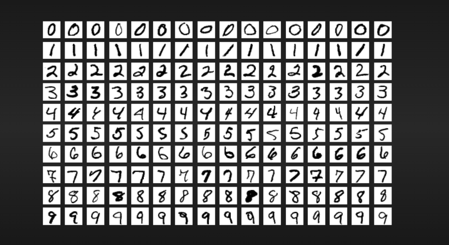
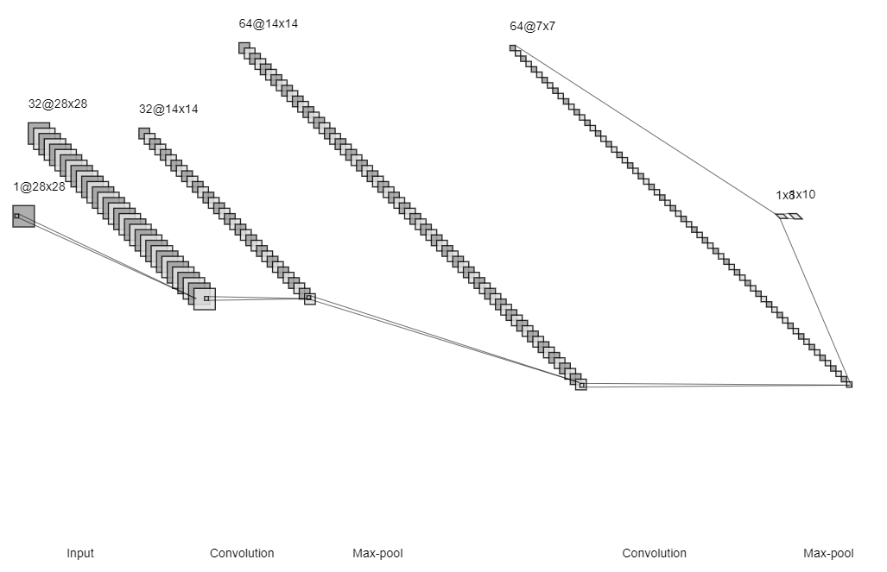
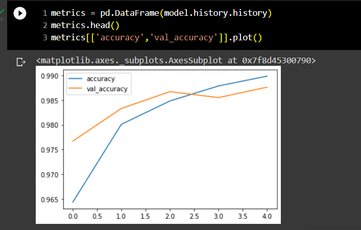
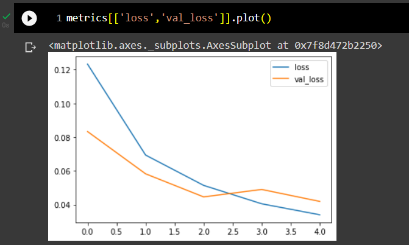
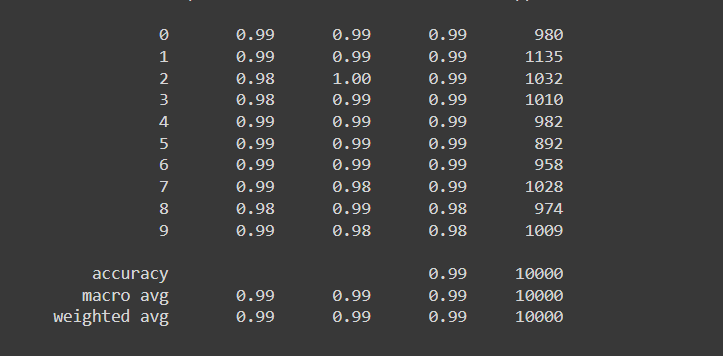
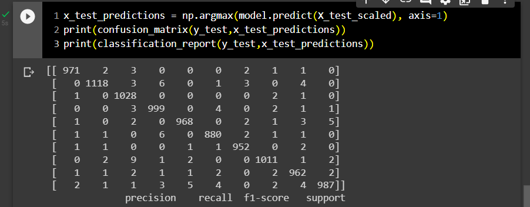
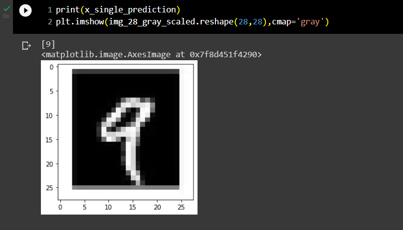

# CONVOLUTIONAL DEEP NEURAL NETWORK FOR DIGIT CLASSIFICATION....

## AIM:

To Develop a convolutional deep neural network for digit classification and to verify the response for scanned handwritten images.

## PROBLEM STATEMENT:

The MNIST database (Modified National Institute of Standards and Technology database) is a large database of handwritten digits that is commonly used for training various image processing systems. The database is also widely used for training and testing in the field of machine learning.
It was created by "re-mixing" the samples from NIST's original datasets. 

The black and white images from NIST were normalized to fit into a 28x28 pixel bounding box and anti-aliased, which introduced grayscale levels.

The MNIST database contains 60,000 training images and 10,000 testing images. Half of the training set and half of the test set were taken from NIST's training dataset, while the other half of the training set and the other half of the test set were taken from NIST's testing dataset. 

## DATASET:



## NEURAL NETWORK MODEL:



## DESIGN STEPS:

### STEP 1:
Import tensorflow and preprocessing libraries.

### STEP 2:
Download and load the dataset.

### STEP 3:
Scale the dataset between it's min and max values.

### STEP 4:
Using one hot encode, encode all the categorical values.

### STEP 5:
Split the dataset into train and test datasets.

### STEP 6:
Build the convolutional neural network model.

### STEP 7:
Train the model with the training data.

### STEP 8:
Plot the performance plot.

### STEP 9:
Evaluate the model with the testing data.

### STEP 10:
Fit the model and predict the single input.

### STEP 11:
End the program.

## PROGRAM:

```python
# Developed by: Anto Richard.S
# Reg.No: 212221240005

Program To Develop a convolutional deep neural network for digit classification and to verify the response for scanned handwritten images.

import numpy as np
import tensorflow as tf
from tensorflow.keras.models import Sequential
from tensorflow.keras.layers import Conv2D
from tensorflow.keras.layers import MaxPool2D
from tensorflow.keras.layers import Dense
from tensorflow import keras
from tensorflow.keras import layers
from tensorflow.keras.datasets import mnist
import tensorflow as tf
import matplotlib.pyplot as plt
from tensorflow.keras import utils
import pandas as pd

from sklearn.metrics import classification_report,confusion_matrix
from tensorflow.keras.preprocessing import image

(X_train, y_train), (X_test, y_test) = mnist.load_data()

X_train.shape
X_test.shape

single_image= X_train[0]
single_image.shape

plt.imshow(single_image,cmap='gray')

y_train.shape

X_train.min()
X_train.max()

X_train_scaled = X_train/255.0
X_test_scaled = X_test/255.0

X_train_scaled.min()
X_train_scaled.max()

y_train[0]

y_train_onehot = utils.to_categorical(y_train,10)
y_test_onehot = utils.to_categorical(y_test,10)

type(y_train_onehot)

y_train_onehot.shape
single_image = X_train[500]
plt.imshow(single_image,cmap='gray')

y_train_onehot[500]
X_train_scaled = X_train_scaled.reshape(-1,28,28,1)
X_test_scaled = X_test_scaled.reshape(-1,28,28,1)

model=Sequential()
model.add(layers.Input(shape=(28,28,1))),
model.add(Conv2D(filters=32,kernel_size=(5,5),strides=(1,1),padding='valid',activation='relu')),
model.add(MaxPool2D(pool_size=(2,2))),
model.add(Conv2D(filters=64,kernel_size=(5,5),strides=(1,1),padding='same',activation='relu')),
model.add(MaxPool2D(pool_size=(2,2))),
model.add(layers.Flatten()),
model.add(Dense(8,activation='relu')),
model.add(Dense(10,activation='softmax'))
model.summary()

model.compile(optimizer='Adam',
              loss='categorical_crossentropy',
              metrics=['accuracy'])

model.fit(X_train_scaled ,y_train_onehot, epochs=5,
          batch_size=64, 
          validation_data=(X_test_scaled,y_test_onehot))   

metrics = pd.DataFrame(model.history.history)  
metrics.head()
metrics[['accuracy','val_accuracy']].plot()

metrics[['loss','val_loss']].plot()

x_test_predictions = np.argmax(model.predict(X_test_scaled), axis=1)
print(confusion_matrix(y_test,x_test_predictions))
print(classification_report(y_test,x_test_predictions))

img = image.load_img('out3.png')
type(img)
img = image.load_img('out3.png')
img_tensor = tf.convert_to_tensor(np.asarray(img))
img_28 = tf.image.resize(img_tensor,(28,28))
img_28_gray = tf.image.rgb_to_grayscale(img_28)
img_28_gray_scaled = img_28_gray.numpy()/255.0

x_single_prediction = np.argmax(
    model.predict(img_28_gray_scaled.reshape(1,28,28,1)),
     axis=1)

print(x_single_prediction)
plt.imshow(img_28_gray_scaled.reshape(28,28),cmap='gray')

```

## OUTPUT:

### TRAINING LOSS, VALIDATION LOSS Vs ITERATION PLOT:



### TRAINING LOSS Vs VALIDATION LOSS:



### CLASSIFICATION REPORT:



### CONFUSION MATRIX:



### NEW SAMPLE DATA PREDICTION:



## RESULT:

 Thus, A convolutional deep neural network for digit classification and to verify the response for scanned handwritten images is developed sucessfully.
